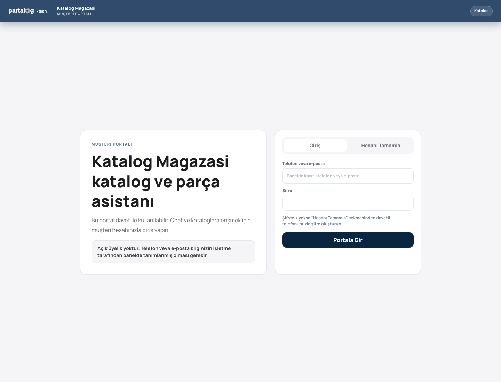
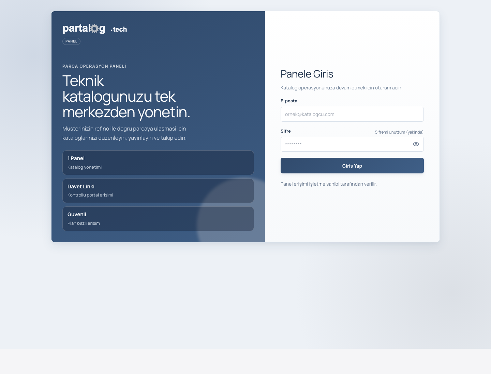
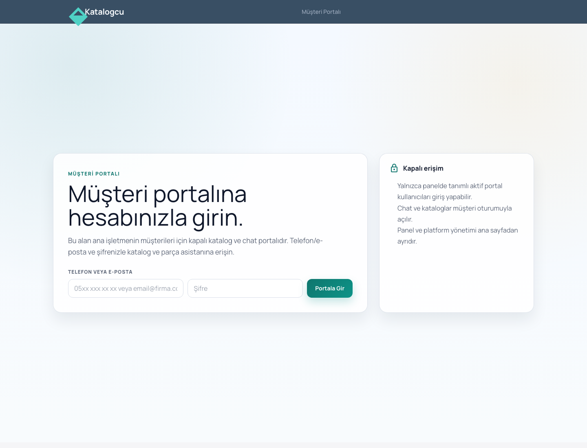

# PartalogAi

PartalogAi, teknik katalogları dijital müşteri portalına dönüştüren; katalog yönetimi, parça arama, public paylaşım, müşteri erişimi ve AI destekli katalog/chat akışlarını tek platformda birleştiren full-stack bir uygulamadır.

Proje; sanayi, yedek parça ve servis ekiplerinin PDF katalogları, ürün listeleri ve müşteri taleplerini daha yönetilebilir hale getirmesi için tasarlanmıştır. Yönetim paneli işletme tarafını, public portal ise müşterinin katalog görüntüleme ve katalog üzerinden soru sorma deneyimini karşılar.

## Showcase

| Public portal | Panel girişi |
|---|---|
|  |  |

| Müşteri portalı |
|---|
|  |

## Öne Çıkanlar

- Dijital katalog yönetimi: PDF yükleme, katalog sayfaları, ürünler, hotspot alanları ve public katalog linkleri.
- Public müşteri portalı: müşteri giriş/tamamlama akışları, token bazlı katalog erişimi ve panelden yönetilen davet modeli.
- AI katalog/chat servisi: FastAPI tabanlı chat, OCR, embedding, vector search, exact-code eşleşmesi, görsel arama ve kalite eval dosyaları.
- Clean Architecture backend: .NET 9 API, CQRS application katmanı, EF Core, PostgreSQL/pgvector, Hangfire ve operasyon scriptleri.
- Angular panel ve portal: yönetim ekranları, public viewer, katalog chat, müşteri erişimi ve platform admin alanları.
- Operasyon disiplini: smoke testler, migration gate, release checklist, staging/load baseline ve Google Cloud Run deploy runbook'ları.
- Güvenlik ve erişim kontrolleri: JWT, public token, self-service kayıt kapatma, SSRF kontrolleri, rate limit ve production readiness guard'ları.

## Mimari

```text
Katalogcu/
├── backend/                  # .NET 9 API, Clean Architecture, EF Core, scriptler
├── frontend/katalogcu-frontend/
│   └── Angular 20 panel, portal ve public katalog arayüzü
├── partalog-ai/              # FastAPI AI servisi, chat/OCR/embedding/eval
├── deploy/google-cloud/      # Cloud Run, staging, monitoring ve release runbook'ları
├── plans/                    # Ürün roadmap'i
├── docs/showcase/            # README için secretsız ekran görüntüleri
├── PROJE_YAPISI.md           # Teknik modül haritası
└── PROJE_SUNUM_RAPORU.md     # GitHub vitrin/ürün sunum raporu
```

Ana akış:

```text
Angular panel/portal
        |
        v
.NET API -> PostgreSQL + pgvector
        |
        v
FastAPI AI servisi -> OCR / embedding / vector search / Gemini provider
```

## Teknoloji Seti

| Katman | Teknolojiler |
|---|---|
| Backend | .NET 9, ASP.NET Core, EF Core, MediatR, FluentValidation, Hangfire |
| Veritabanı | PostgreSQL, pgvector, Redis opsiyonları |
| Frontend | Angular 20, TypeScript 5.9, RxJS, Tailwind/PostCSS |
| AI Servisi | FastAPI, Python, aiohttp/httpx, PyMuPDF, OpenCV, EasyOCR, YOLO, embeddings |
| Operasyon | Docker Compose, Google Cloud Run, GitHub Actions, smoke/load/preflight scriptleri |

## Hızlı Başlangıç

### Gereksinimler

- .NET 9 SDK
- Node.js 22 ve npm 10+
- Python 3.10+
- Docker ve Docker Compose
- PostgreSQL/pgvector; Docker Compose ile otomatik gelir

### Docker Compose ile çalıştırma

```bash
cd backend
docker compose up -d --build
```

Varsayılan lokal servisler:

| Servis | Adres |
|---|---|
| Frontend | `http://localhost:4200` |
| Backend API | `http://localhost:5159` |
| Swagger | `http://localhost:5159/swagger` |
| Partalog AI | `http://localhost:8000` |
| PostgreSQL | `localhost:5432` |

> Not: AI servisi lokal geliştirmede `partalog-ai/.env` dosyasını kullanır. Secret içeren `.env` dosyaları repoya commit edilmemelidir.

### Manuel geliştirme

Backend:

```bash
cd backend/Katalogcu.API
dotnet restore
dotnet run
```

Frontend:

```bash
cd frontend/katalogcu-frontend
npm install
npm start
```

AI servisi:

```bash
cd partalog-ai
pip install -r requirements.txt
python main.py
```

## Doğrulama ve Testler

Backend testleri:

```bash
dotnet test backend/Katalogcu.sln
```

Frontend derleme/test:

```bash
cd frontend/katalogcu-frontend
npm run test:compile
npm run test:ci
```

Full-stack smoke:

```bash
export PARTALOG_PUBLIC_TOKEN="..."
./backend/scripts/smoke_all.sh
```

Release öncesi katalog-only preflight:

```bash
./backend/scripts/preflight_catalog_only.sh --api-url http://localhost:5159
```

## Dokümantasyon Haritası

| Doküman | Amaç |
|---|---|
| [`PROJE_SUNUM_RAPORU.md`](./PROJE_SUNUM_RAPORU.md) | GitHub vitrini için ürün, mimari, kalite ve operasyon özeti |
| [`PROJE_YAPISI.md`](./PROJE_YAPISI.md) | Klasörler, katmanlar ve ana teknik akışlar |
| [`PROJECT_FILE_REPORT.md`](./PROJECT_FILE_REPORT.md) | Dosya envanteri, temizlik durumu ve kalan inceleme adayları |
| [`backend/DOCKER_ORCHESTRATION.md`](./backend/DOCKER_ORCHESTRATION.md) | Docker Compose servisleri ve lokal orkestrasyon |
| [`backend/SMOKE_TESTS.md`](./backend/SMOKE_TESTS.md) | Public checkout ve full-stack smoke test akışları |
| [`backend/MIGRATION_DISCIPLINE.md`](./backend/MIGRATION_DISCIPLINE.md) | EF migration disiplini ve CI kapıları |
| [`backend/CATALOG_ONLY_PROD_CHECKLIST.md`](./backend/CATALOG_ONLY_PROD_CHECKLIST.md) | Catalog-only canlıya çıkış kontrol listesi |
| [`backend/CATALOG_ONLY_RELEASE_GO_NO_GO.md`](./backend/CATALOG_ONLY_RELEASE_GO_NO_GO.md) | Release karar formu |
| [`deploy/google-cloud/portal-panel-release-checklist.md`](./deploy/google-cloud/portal-panel-release-checklist.md) | Portal/panel domain ayrımı ve postdeploy kontrolleri |
| [`partalog-ai/eval/README.md`](./partalog-ai/eval/README.md) | Chat kalite eval dosyaları ve eşik mantığı |

## Güvenlik ve Operasyon Notları

- Self-service panel kaydı kontrollü şekilde kapatılmıştır; ilk kullanıcılar bootstrap scripti ile oluşturulur.
- Public katalog/chat erişimi token, müşteri oturumu ve katalog yetkisi üzerinden sınırlandırılır.
- AI akışlarında kapasite, retry, cache, fallback reason ve stream contract kontrolleri vardır.
- Production deploy için catalog-only, catalog-chat ve portal/panel runbook'ları ayrı tutulur.
- Staging/load baseline süreci, rastgele load sonucunu değil review edilmiş baseline'ı promote etmeyi hedefler.

## Lisans

Bu proje MIT lisansı ile yayınlanır. Detaylar için [`LICENSE`](./LICENSE) dosyasına bakın.
