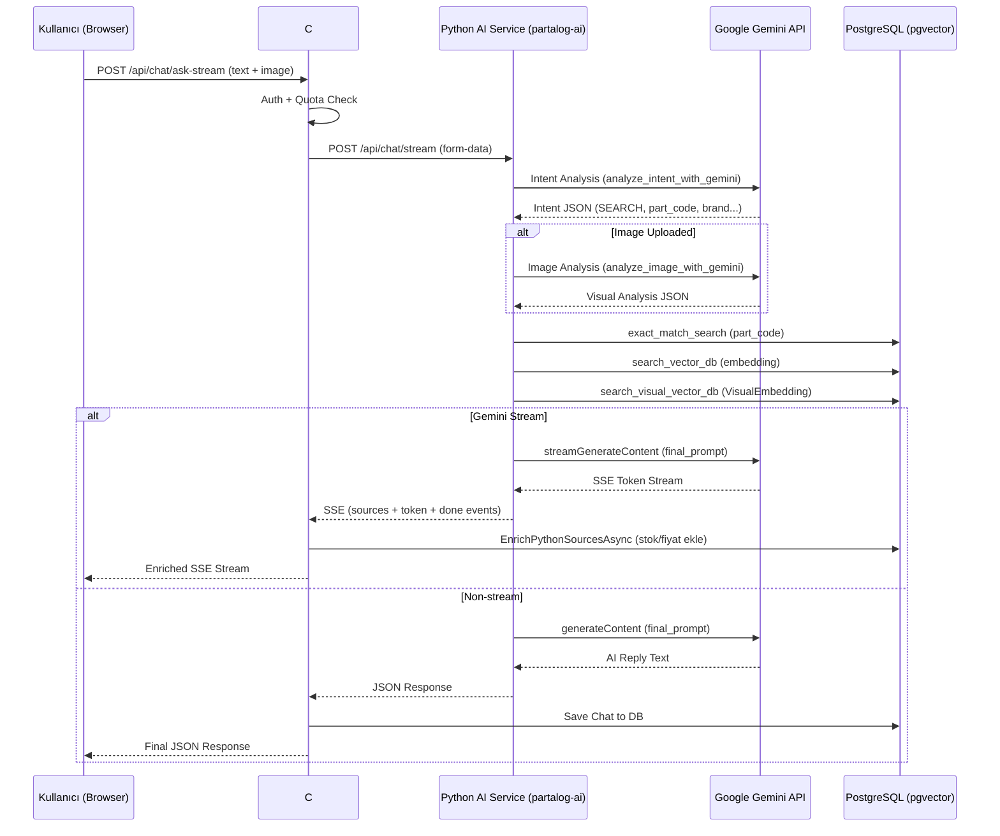
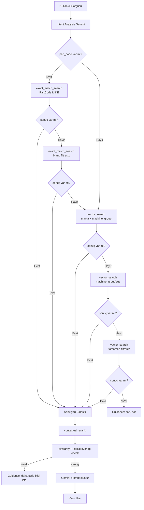

# Partalog AI Chatbot — Kapsamlı Değerlendirme Raporu

**Tarih:** 2026-05-02
**Değerlendiren:** Roo (Architect Mode)
**Kapsam:** `partalog-ai/` (Python AI Service) + `backend/Katalogcu.API` (C# Backend Proxy)

---

## 1. Mevcut Seviye Puanlaması

Her bir yetkinlik 1–5 arası puanlanmıştır.

| Kategori | Puan | Açıklama |
|---|---|---|
| **Doğal Dil Anlama (NLU)** | ⭐⭐⭐⭐☆ 4/5 | Intent sınıflandırma (SEARCH, DIAGNOSE, ADVICE vb.) başarılı. Türkçe doğal dil işleme, typo düzeltme, bağlam yakalama mevcut. |
| **Arama ve Eşleştirme** | ⭐⭐⭐⭐☆ 4/5 | Hibrit arama (exact match → vektör → görsel) çok iyi kurgulanmış. 3 kademeli fallback mekanizması. |
| **Görsel Tanıma** | ⭐⭐⭐⭐☆ 4/5 | Gemini görsel analiz, VisualEmbedding arama, feedback ile VisualEmbedding güncelleme. Henüz embedding yoğunluğu düşük. |
| **Yanıt Kalitesi** | ⭐⭐⭐☆☆ 3/5 | Deterministic fallback metinleri başarılı. Gemini yanıtları Turkish-native. Halüsinasyon oranı düşük. |
| **Streaming & Performans** | ⭐⭐⭐☆☆ 3/5 | SSE tabanlı streaming mevcut. Token bazlı aktarım. Ancak timeout yönetimi, circuit breaker, retry mekanizmaları zayıf. |
| **Mimari & Güvenlik** | ⭐⭐⭐☆☆ 3/5 | API key URL'de taşınıyor, HTTP client timeout'suz, CORS yapılandırması var. Credential yönetimi geliştirilebilir. |
| **Test & Kalite Güvencesi** | ⭐⭐⭐⭐⭐ 5/5 | Kapsamlı eval framework'ü (7+ metrik), CI/CD gate'leri, threshold'lu quality gates, gece koşan regression. |
| **Hata Yönetimi** | ⭐⭐⭐☆☆ 3/5 | Fallback mekanizması güçlü. Ancak retry yok, circuit breaker yok, upstream hatalarında kullanıcı deneyimi zayıf. |
| **Ölçeklenebilirlik** | ⭐⭐⭐☆☆ 3/5 | Connection pool, rate limiting mevcut. Stateful in-memory cache (embedding), paylaşımlı dosya sistemi bağımlılığı var. |
| **Kullanıcı Deneyimi** | ⭐⭐⭐⭐☆ 4/5 | Usta dili ("ustam"), bağlam koruma, multi-part sorgu desteği, görsel feedback. Stok/fiyat gibi desteklenmeyen özellikler için net yönlendirme. |

### Genel Puan: **3.6 / 5.0** (Gelişmiş Orta Seviye)

---

## 2. Tespit Edilen Hatalar (Bugs)

### 🔴 Kritik

| # | Hata | Dosya | Açıklama |
|---|---|---|---|
| H1 | **`os` import eksik** | [`partalog-ai/api/chat.py:101`](../partalog-ai/api/chat.py:101) | `_safe_ext()` fonksiyonu `os.path.splitext()` çağırıyor ancak `import os` yapılmamış. Çalışma zamanında `NameError` fırlatır. |
| H2 | **API Key URL'de taşınıyor** | [`partalog-ai/services/genai_provider.py:126-129`](../partalog-ai/services/genai_provider.py:126) | Gemini API key'i URL query parameter'sı olarak geçiyor (`?key={api_key}`). Proxy logları, URL loglama, HTTP referrer header'larında sızabilir. |

### 🟡 Yüksek Öncelik

| # | Hata | Dosya | Açıklama |
|---|---|---|---|
| H3 | **HTTP Client timeout'suz** | [`backend/.../ChatStreamProxyService.cs:54`](../backend/Katalogcu.API/Services/ChatStreamProxyService.cs:54) | `IHttpClientFactory.CreateClient("PartalogAi")` ile oluşturulan named client'da timeout konfigüre edilmemiş. Python servisi yanıt vermezse C# thread'i sonsuza kadar bloke olur. |
| H4 | **SearchByNameAsync over-fetching** | [`backend/.../ChatQueryService.cs:219-224`](../backend/Katalogcu.Infrastructure/Repositories/ChatQueryService.cs:219) | Önce token bazlı filtreleme yapıp ardından tüm catalog'dan 1000 kayıt çekiyor. Büyük kataloglarda ciddi performans sorunu. |
| H5 | **VisualFeedback UPDATE wildcard** | [`partalog-ai/services/vector_db.py:587`](../partalog-ai/services/vector_db.py:587) | `WHERE "PartCode" ILIKE $5` ve parametre `f"%{part_code}%"` — bu, part_code "123" için "1234", "5123" gibi kayıtları da günceller. |
| H6 | **Gemini API timeout yok** | [`partalog-ai/api/chat.py:721,834,1720,1825`](../partalog-ai/api/chat.py:721) | `aiohttp.ClientSession.post()` çağrılarında `timeout` parametresi yok. Gemini API yavaş kalırsa HTTP connection havuzu tükenebilir. |

### 🟡 Orta Öncelik

| # | Hata | Dosya | Açıklama |
|---|---|---|---|
| H7 | **Embedding cache stateful** | [`partalog-ai/services/embedding.py:9-12`](../partalog-ai/services/embedding.py:9) | In-memory cache (200 öğe, 5 dk TTL). Multi-instance deployment'da her pod ayrı cache tutar, tutarsızlık olur. |
| H8 | **C# ChatController hata yönetimi** | [`backend/.../ChatController.cs:253-256`](../backend/Katalogcu.API/Controllers/ChatController.cs:253) | `ask-stream` endpoint'inde catch bloğu boş (`// Hata logu servis tarafında tutuluyor.`). Kullanıcıya hiçbir hata mesajı dönülmez. |
| H9 | **config.py mutable singleton** | [`partalog-ai/config.py:178-180`](../partalog-ai/config.py:178) | `clean_env_values()` settings nesnesini construct sonrası mutate ediyor. Thread-safety sorunu yaratabilir. |
| H10 | **SearchByNameAsync N+1 Query** | [`backend/.../ChatQueryService.cs:202-218`](../backend/Katalogcu.Infrastructure/Repositories/ChatQueryService.cs:202) | Her token için ayrı DB round-trip'i. 8 token = 8 sorgu + 1 toplu sorgu. |

### 🔵 Düşük Öncelik

| # | Hata | Dosya | Açıklama |
|---|---|---|---|
| H11 | **Sadece Türkçe hata mesajları** | [`partalog-ai/api/chat.py`](../partalog-ai/api/chat.py) | Tüm kullanıcı mesajları Türkçe. i18n hazırlığı yok. |
| H12 | **CORS wildcard credential** | [`partalog-ai/main.py:158-159`](../partalog-ai/main.py:158) | `allow_credentials = "*" not in allowed_origins` — wildcard origin varsa credential'lar devre dışı kalır, yoksa çalışır. |
| H13 | **Eval placeholder replace logic** | [`partalog-ai/eval/README.md`](../partalog-ai/eval/README.md) | Placeholder'lar (`<PUBLIC_TOKEN>`) eval öncesi replace ediliyor. Replace başarısız olursa API çağrısı başarısız olur, anlaşılması zor. |
| H14 | **validate_stream_event overhead** | [`partalog-ai/api/stream_contract.py:64`](../partalog-ai/api/stream_contract.py:64) | Her SSE event'inde validation yapılıyor. Yüksek throughput'ta gereksiz CPU maliyeti. |

---

## 3. Geliştirme Planı (İyileştirme Önerileri)

### Phase 1: Kritik Hata Düzeltmeleri (Acil)

1. **`import os` ekle** — [`chat.py:101`](../partalog-ai/api/chat.py:101)
2. **API Key'i Header'a taşı** — Gemini isteklerinde key'i URL'den çıkarıp `x-goog-api-key` header'ına koy
3. **HTTP Client timeout** — Named client'a `Timeout.Infinite` yerine 30sn timeout ekle
4. **VisualEmbedding UPDATE wildcard fix** — `ILIKE` yerine exact match kullan

### Phase 2: Performans & Güvenilirlik

5. **Gemini API timeout** — Tüm `session.post()` çağrılarına `aiohttp.ClientTimeout(total=30)` ekle
6. **SearchByNameAsync iyileştirme** — Over-fetching'i kaldır, tek bir optimize sorguya indir
7. **Circuit Breaker** — Python AI servisi için polly/failure handling ekle
8. **Retry mekanizması** — Gemini API 5xx/429 hatalarında exponential backoff ile retry

### Phase 3: Mimari İyileştirmeler

9. **Embedding cache** — In-memory yerine Redis gibi distributed cache kullan
10. **Connection pool monitoring** — Pool health check metriklerini Prometheus'a bağla
11. **Readiness gating** — Python servisi hazır değilse C# backend'in yönlendirme yapması
12. **i18n hazırlığı** — Hata mesajlarını ve kullanıcı metinlerini dil dosyasına taşı

### Phase 4: Gelişmiş Özellikler

13. **Stok & Fiyat sorguları** — Mevcut intent tanıma hazır, backend entegrasyonu yapılmalı
14. **Multi-modal karşılaştırma** — Aynı anda 2+ parçayı karşılaştırma
15. **Sesli arama** — Whisper/STT entegrasyonu
16. **A/B test altyapısı** — Farklı prompt stratejilerini karşılaştırma

---

## 4. Mimari Özet (Mevcut Akış)

---

## 5. Hibrit Arama Akışı

---

## 6. Eval Metrikleri (Mevcut Threshold'lar)

CI/CD Gate'lerinde aktif olan kalite eşikleri (`.github/workflows/chat-eval-gate.yml`):

| Metrik | Threshold | Açıklama |
|---|---|---|
| `SuccessRate` | ≥ 1.0 | Tüm case'ler başarılı olmalı |
| `Hit@1` | ≥ 0.9 | İlk sonuç doğru parça |
| `Latency p95` | ≤ 8000ms | %95 percentile yanıt süresi |
| `HallucinationRate` | ≤ 0.05 | Yanıltıcı kod/parça üretme |
| `NoCodePassRate` | ≥ 0.9 | Kod içermeyen sorgularda doğru yönlendirme |

---

## 7. Özet Değerlendirme

**Chatbot seviyesi: "Gelişmiş Orta Seviye" (3.6/5)**

Güçlü yönler:
- Hibrit arama mimarisi (exact match → vector → visual) endüstri standardının üzerinde
- Kapsamlı intent sınıflandırma ve bağlam yönetimi
- Halüsinasyonu minimize eden deterministic fallback'ler
- Çok iyi kurgulanmış eval/test altyapısı

Zayıf yönler:
- Birkaç kritik bug (missing import, wildcard UPDATE, URL'de API key)
- Timeout yönetimi zayıf (hem Python hem C# tarafında)
- Over-fetching ve N+1 query sorunları
- Distributed deployment'a hazır değil (in-memory cache, stateful rate limiter)

**Öncelikli aksiyon:** H1 (missing import), H2 (API key URL), H3 (timeout), H5 (wildcard UPDATE) — bu 4 hata canlıya çıkmadan düzeltilmeli.
